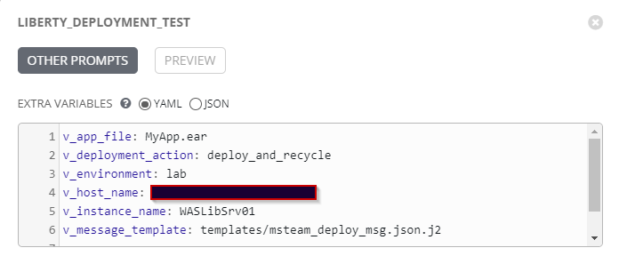
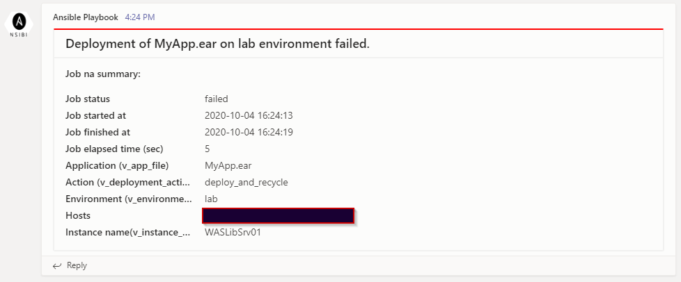
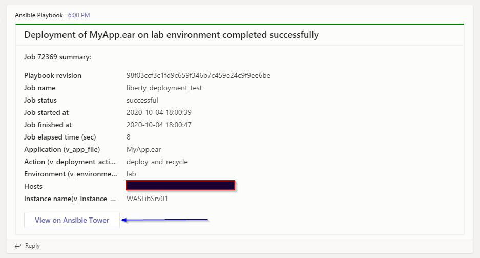

# Example playbook to show the use of msteam callback plugin

 Version | Date Modified | Comments          |
---------|---------------|-------------------|
1.0.0    | 04 Oct 2020   | Initial commit    |

## Introduction

This is an example Ansible playbook to demo the use of `msteam` callback plugin to send notification to MS Teams channel using Jinja2 template as message card.  

See my blog [How to Write a Custom Ansible Callback Plugin to ost to MS Teams using Jinja2 Template as a Message Card][msteams_blog_url]

## Installation - General

1. Clone this repository.
2. Try. You need to update the default MS Teams WebHook URL directly into the `msteam` plugin source code or pass as extra-vars as given below. Below is the command line example:  

    ```bash
    ansible-playbook -i inventory/default.ini deploy_app.yml -e "@example_data.json"
    ```
    
    Note: if you like to test the failure, just pass extra variable ("v_failed": "yes").

3. Example of extra-vars  
    

## Parameters as Playbook Extra-Vars

This plugin can be managed by the following ansible extra-vars passed through your playbook.

| Variable                        | Type          | Mandatory | Example   |
| ------------------------------- | ------------- | --------- | --------- |
| ``v_success_channel_url``       | String        | No (uses default if not provided) | ``"v_success_channel_url": "<success channel url>"`` |
| ``v_failure_channel_url``       | String        | No (uses default if not provided) | ``"v_failure_channel_url": "<failure channel url"`` |
| ``v_msteam_channel_url``        | String        | No (Overrides the default channel url value). | ``"v_msteam_channel_url": "<webhook url>"`` |
| ``v_message_template``          | String        | No (uses default if not provided)  | ``"v_message_template": "templates/msteam_deploy_msg.json.j2"`` |
| ``v_disable_msteam_post``       | String        | No (default 'No'). Another way to disable posting to MS Teams. | ``"v_disable_msteam_post": "Yes"``.  |

## How to get updates from submodule

If you decide to use this plugin as `git submodule`. Here is how you can get the updates.  

1. Open `git bash` and change to your playbook repository directory and run the commands listed below. In the example below, I'm getting updates for playbook `ansible_msteam_callback_plugin_using_jinja2_template_example`:  

   ```bash
   cd ~/workspace/ansible_msteam_callback_plugin_using_jinja2_template_example
   git submodule update --remote
   # run git status to see if there is any change in submodule
   git status
   # if there is any change, add the submodule change, commit and push. For example
   git add callback_plugins
   git commit -m "Accepting and adding the latest from callback_plugins"
   #git push -u origin <your branch>
   git push -u origin master
   ```

## Screenshots of posted messages

1. Executed from command line - Failure message
    

2. Executed from Ansible Tower - Success message
    

[msteams_blog_url]: https://purnapoudel.blogspot.com/2020/10/how-to-write-ansible-callback-plugin.html